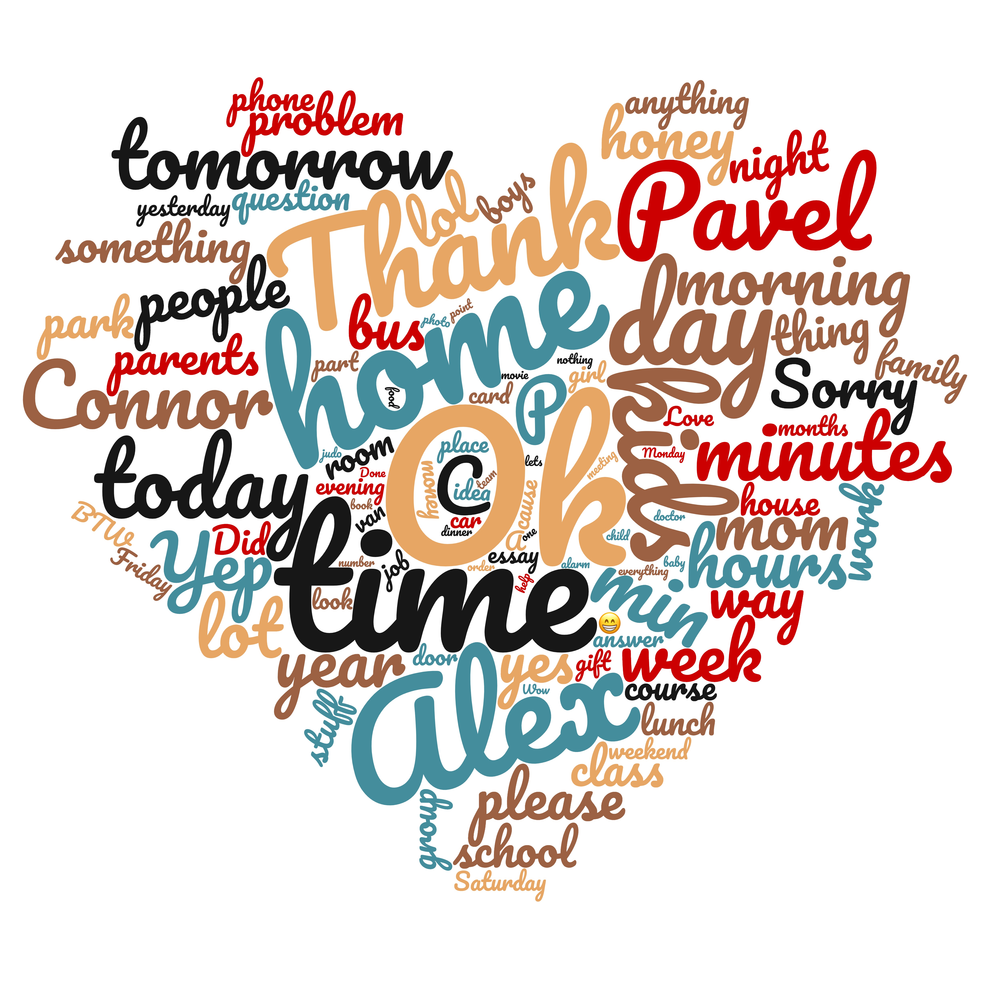

# Be my Valentine (2019)

As a Valentine's Day gift to my amazing wife, I wanted to create a
[word cloud](https://www.wordclouds.com/) using the messages that we've
exchanged since we met. We have been using Google Hangouts for most of our
messages so just using the words in those messages (and ignoring text messages,
Facebook messages, etc.) seemed like it would be a good enough.

The final command that I used generate the weighted list of words for the
word cloud was:

```commandline
./extract_hangouts_messages.py --gaia-id=XXX <Hangouts.json | \
         ./extract_words.py --interesting-words=nouns | \
         ./count_words.py --grouping=stem --count=sqrt
```

Resulting in output like:
```commandline
26	Ok
22	time
21	home
18	Alex
17	Thank
16	kids
16	day
```

I then used [this online word cloud generator](https://www.wordclouds.com/)
to create this:



Then I had it [framed](https://www.americanframe.com).

_(wife not included)_

I gave a presentation on this at [BayPIGgies](http://baypiggies.net/) with
[slides](https://docs.google.com/presentation/d/1-s-0AfgNjmfUI_EOBHvGSduv_YUrw1GhnLCg1tN5LMs/edit?usp=sharing).
# How To

## Extracting the data

Your complete Google Hangouts message history can be downloaded using
[Google Takeout](https://takeout.google.com/). My complete history was
669.1 MB and took a few hours to export (I don't exchange a lot of images).

Inside the Takeout data is a file called `Hangouts.json`. This file
includes the text of every message that you've exchanged.

You can extract the text of all messages in this file using with:
```commandline
./extract_hangouts_messages.py <Hangouts.json
``` 

Since I wanted to only include messages between my wife and I, I added my
wife's GAIA id as an extraction argument:

```commandline
./extract_hangouts_messages.py --gaia-id=XXX <Hangouts.json
``` 

You can find the correct GAIA id for the person that you are looking for by
running:

```commandline
./extract_gaia_ids.py <Hangouts.json
```

## Extracting interesting words

Now that you have all of the words for your messages, you need to filter out
the boring one like "of", "and", "could", "do", etc.

I experimented with several approaches here but decided to exclude
everything except nouns. Theoretically, this makes words like "love" much
less common (since it is most often used as a verb) but my wife and I often
write ungrammatical things like "Love you" and "Love you too". This poor
grammar causes these words to be misclassified as nouns.

You can extract the words with `extract_words.py`.

`extract_words.py` reads from stdin and writes to stdout. Using it on a
large corpus - "The Adventures of Sherlock Holmes":

```commandline
curl https://norvig.com/big.txt | ./extract_words.py
``` 

You can compose it with `extract_hangouts_messages.py` like:

```commandline
./extract_hangouts_messages.py <Hangouts.json | ./extract_words.py
```

For a complete list of word filtering options, run:

```commandline
./extract_words.py --help
```

To filter out everything but the nouns, I used the `--interesting-words=nouns`
option:

```commandline
./extract_hangouts_messages.py <Hangouts.json | ./extract_words.py --interesting-words=nouns
```


## Counting the words

Now that you have a stream of words produced by `extract_words.py`, you need
to count them to come up with their relative weight in the word cloud.

`count_words.py` will do that are return a result compatible with the input
expected by [WordClouds.com](https://www.wordclouds.com/).

`count_words.py` reads one word per line from stdin and writes the frequency of
each word found to stdout:

```commandline
./count_words.py <<EOF
Bat
Cat
Cat
Sat
Bat
Cat
EOF
```

`count_words.py` has several command flags that can be provided. To learn
about their semantics, run:

```commandline
./count_words.py --help
```

I used the option `--grouping==stem`, which causes words like "jumps",
"jumped" and "jumps" to be counted like one word.

I also used the option `--counting=sqrt` to output the square-root of the 
actual frequency. This reduces the output range and made, in my case, the
words a more pleasing size in the final word cloud.
